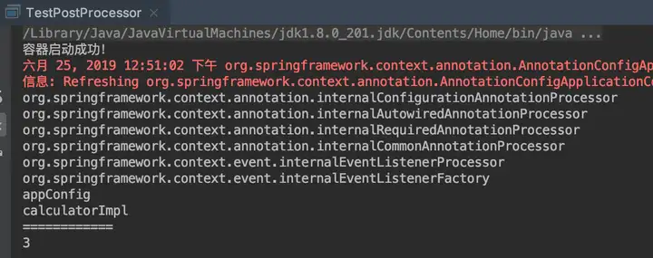
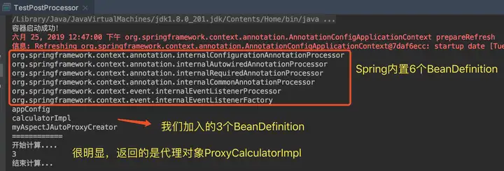

大致了解Spring Bean的创建流程后,接下来我们尝试着用BeanPostProcessor返回当前Bean的代理对象。

```java
        <dependency>
            <groupId>org.springframework</groupId>
            <artifactId>spring-aspects</artifactId>
        </dependency>
```

Calculator接口

```java
package com.hm.debugaopv2.service;

/**
 * @Author: hmly
 * @Date: 2025/3/1 20:17
 * @Project: spring-practice
 * @Version: 1.0.0
 * @Description: 计算器接口
 */
public interface Calculator {
    /**
     * a + b
     * @param a
     * @param b
     */
    public void add(int a, int b);
}

```

CalCulatorImpl

```java
@Component
public class CalCulatorImpl implements Calculator {
    @Override
    public void add(int a, int b) {
        System.out.println("a + b = " + (a + b));
    }
}

```

后置处理器MyAspectJAutoProxyCreator

使用步骤：

1. 实现BeanPostProcessor
2. @Component加入Spring容器

```java
package com.hm.debugaopv2.component;

import com.hm.debugaopv2.service.Calculator;
import org.springframework.beans.BeansException;
import org.springframework.beans.factory.config.BeanPostProcessor;
import org.springframework.context.annotation.Configuration;
import org.springframework.stereotype.Component;

import java.lang.reflect.InvocationHandler;
import java.lang.reflect.Method;
import java.lang.reflect.Proxy;
/**
 * @Author: hmly
 * @Date: 2025/3/1 20:29
 * @Project: spring-practice
 * @Version: 1.0.0
 * @Description:
 * eg. 不加@Component注解，打印如下，说明AOP代理没有生效
 * ---------------
 * a + b = 3
 *
 * eg. 加@Component注解，打印如下，说明AOP代理生效了：MyAspectJAutoProxyCreator
 * ---------------
 * 开始计算...
 * a + b = 3
 * 结束计算...
 */
@Component
public class MyAspectJAutoProxyCreator implements BeanPostProcessor {

    @Override
    public Object postProcessBeforeInitialization(Object bean, String beanName) throws BeansException {
        return bean;
    }

    @Override
    public Object postProcessAfterInitialization(Object bean, String beanName) throws BeansException {
        // 仅对Calculator类型bean创建代理
        if (bean instanceof Calculator) {
            return Proxy.newProxyInstance(
                    bean.getClass().getClassLoader(),
                    bean.getClass().getInterfaces(),
                    new InvocationHandler() {
                        @Override
                        public Object invoke(Object proxy, Method method, Object[] args) throws Throwable {
                            System.out.println("开始计算...");
                            Object result = method.invoke(bean, args);
                            System.out.println("结束计算...");
                            return result;
                        }
                    });
        }
        // 非Calculator类型返回原始bean
        return bean;
    }
}
```

测试类TestPostProcessor

```java
package com.hm.debugaopv2.test;

import com.hm.debugaopv2.DebugAopV2Application;
import com.hm.debugaopv2.service.Calculator;
import org.springframework.context.annotation.AnnotationConfigApplicationContext;

/**
 * @Author: hmly
 * @Date: 2025/3/1 20:36
 * @Project: spring-practice
 * @Version: 1.0.0
 * @Description:
 */

public class TestPostProcessor {
    public static void main(String[] args) {
        System.out.println("容器启动成功！");

        // 创建应用上下文（需指定配置类：包扫描类）
        // SpringBoot场景下，主启动类就是配置类包扫描类
        //@Target(ElementType.TYPE)
        //@Retention(RetentionPolicy.RUNTIME)
        //@Documented
        //@Inherited
        //@SpringBootConfiguration
        //@EnableAutoConfiguration
        //@ComponentScan(excludeFilters = { @Filter(type = FilterType.CUSTOM, classes = TypeExcludeFilter.class),
        //		@Filter(type = FilterType.CUSTOM, classes = AutoConfigurationExcludeFilter.class) })
        //public @interface SpringBootApplication
        AnnotationConfigApplicationContext applicationContext =
                new AnnotationConfigApplicationContext(DebugAopV2Application.class);

        // 获取所有Bean定义名称
        String[] beanDefinitionNames = applicationContext.getBeanDefinitionNames();

        // 打印当前容器所有BeanDefinition
        System.out.println("--- Bean列表 ---");
        for (String beanName : beanDefinitionNames) {
            System.out.println(beanName);
        }
        System.out.println("---------------");

        // 获取Calculator实例并调用方法
        Calculator calculator = applicationContext.getBean(Calculator.class);
        calculator.add(1, 2);

        // 关闭容器
        applicationContext.close();
    }
}
```

运行测试类：

eg. 先把MyAspectJAutoProxyCreator的@Component注释掉,此时Spring中没有我们自定义的后置处理器,那么返回的就是Calculatorlmpl:



eg. 把@Component加上,此时MyAspectJAutoProxyCreator加入到Spring的BeanPostProcessors中,会拦截到Calculatorlmpl,并返回代理对象:

